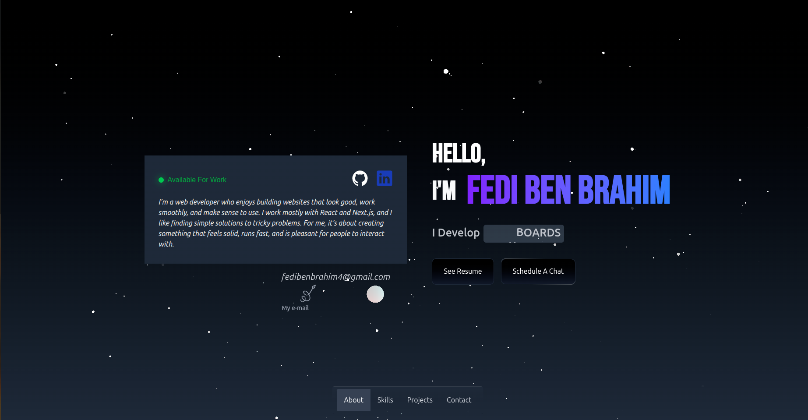

# Fedi's Portfolio

My personal portfolio website built with React, showcasing my projects and skills.

## 🌐 Live Demo

Visit my portfolio at: [https://fedi.dev](https://fedi.dev)

## 📸 Preview

## 🛠️ Built With

- React.js
- CSS3
- Vite

## 🚀 Features

- Responsive design
- Project showcase
- Skills section
- Contact information

## ⚙️ Setup

1. Clone the repository
2. Install dependencies: `npm install`
3. Run development server: `npm run dev`

## 📝 License

MIT License
